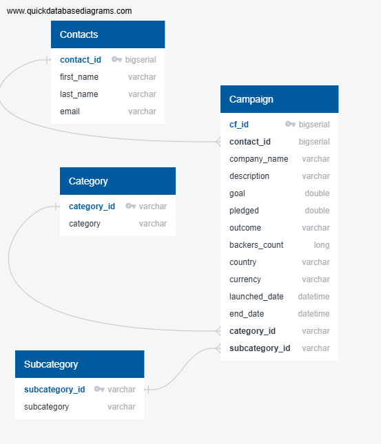

# Crowdfunding_ETL
- Module 13 Mini Project
- Steph Abegg, Eric Lidiak, Ross Boersma

This repository is for the Project 2 crowdfunding ETL (Extract, Transform and Load) challenge. For the ETL mini project, we worked with our Project 1 teams to practice building an ETL pipeline using Python, Pandas, and either Python dictionary methods or regular expressions to extract and transform the data. After transforming the data, four CSV files were created and then used to create an ERD and a table schema and uplodaed into a Postgres database.

## Tasks

Ths mini project is divided into the following subsections:

(1) Create the Category and Subcategory DataFrames

(2) Create the Campaign DataFrame

(3) Create the Contacts DataFrame

(4) Create the Crowdfunding Database

Each of these subsectons, and the related output, is described below.

## Final ETL_Mini_Project Notebook

As we worked through the project deliverables, we broke up the work across other notebooks that we each worked on individually. For our final submission, we combined all the subsections back into the final ETL_Mini_Project notebook: [ETL_Mini_Project_SAbegg_RBoersma_ELidiak.ipynb](ETL_Mini_Project_SAbegg_RBoersma_ELidiak.ipynb).

## Task 1: Create the Category and Subcategory DataFrames

In this part of the project, we extracted and and transformed the crowdfunding.xlsx Excel data to create category and subcategory DataFrames. These dataframes are shows below.

The category and subcategory DataFrames were exported into [category.csv](Resources/category.csv) and [subcategory.csv](Resources/subcategory.csv).

## Task 2: Create the Campaign DataFrame

In this part of the project, we extracted and transformed the crowdfunding.xlsx Excel data to create a campaign DataFrame. The first five rows of this dataframe are shown below.

The campaign DataFrame was exported into [campaign.csv](Resources/campaign.csv).

## Task 3: Create the Contacts DataFrame

In this part of the project, we extracted and transformed the data from the contacts.xlsx Excel data. There were two options for doing this: (1) Use Python dictionary methods, (2) Use regular expressions. We did both. The first ten rows of this dataframe are shown below. 

The contacts DataFrame was exported into [contacts.csv](Resources/contacts.csv).

## Task 4: Create the Crowdfunding Database

In this part of the project, the dataframes created in previous sections were used to create a database. 

First, an Entity Relationsihp Diagram of the tables was created by using QuickDBD:

Then, a table schema was created each CSV file; the database schema was saved as a Postgres file named [crowdfunding_db_schema.sql](crowdfunding_db_schema.sql) and [crowdfunding_db_schema.sql](crowdfunding_db_schema.sql). Next, a new Postgres database named crowdfunding_db was created in PgAdmin, and the tables were added in the correct order to handle the foreign keys. Finally, the csv for each file was imported into its corresponding SQL table.

The following output (generated by running a SELECT * FROM statement for each table) verifies that each table has the correct data.

contacts:

category:

subcategory:

campaign:

